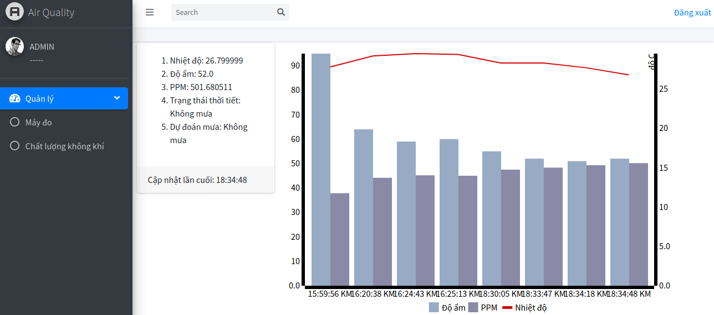

# air-quality
#### [PTIT] Bài tập lớn môn Hệ Thống Nhúng:
Trạm quản lý máy đo chất lượng không khí và dự báo mưa bằng mô hình chuỗi markov ẩn

#### Tech: Adruino, Spring Boot, NodeMCU 8086

##### Demo: https://air-quality-server2.herokuapp.com/air-qualities

